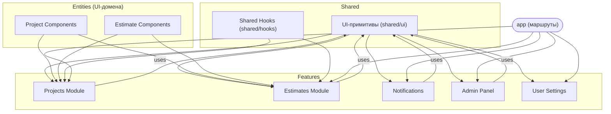

# Краткое резюме  
В приложении SMetalabv3 UI-компоненты организованы не полностью последовательно: базовые кнопки, формы, «примитивы» UI находятся в `components/ui/`, а специфичные для домена компоненты — в `features/**/components`. Бизнес-логика иногда смешана с UI (например, вызовы репозиториев внутри компонентов【63†L142-L149】【52†L15-L19】), а стилизация делается с помощью ad-hoc классов вместо явных вариантов (пример – кнопка удаления сметы: `variant="ghost"` с правками цвета и размера в `className`【63†L142-L149】). Мы предлагаем четко разграничить слои по шаблону «**shared/ui**, **entities**, **features**», задать полный набор параметров для базовой кнопки (variant, size, isLoading, icon и т.д.) и единые правила использования тем/вариантов (основанные на дизайне shadcn/Tailwind). Ниже – детальный анализ, предложенная структура проекта, схема слоев и компонентов, таблица рекомендаций по файлам, а также план миграции с приоритетами и оценкой сложности.

## Текущая структура и найденные проблемы  
- **UI-примитивы (`components/ui/**`):** По документации, каталог `components/ui` содержит «только переиспользуемые shadcn/Radix примитивы»【52†L4-L11】 (кнопки, поля ввода, поповеры и т.д.). Действительно, там лежат файлы `button.tsx`, `input.tsx`, `badge.tsx`, `tabs.tsx` и др. Например, `button.tsx` определяет варианты `default`, `destructive`, `outline`, `secondary`, `ghost`, `link`【4†L9-L17】. Эти базовые кнопки используются по всему приложению: их импортируют и используют в компонентах фич (например, в `ProjectEstimatesTable.tsx`)【15†L53-L59】. Это соответствует архитектурным правилам (UI-примитивы не должны знать про домен)【52†L15-L19】.  
- **Смесь логики и UI:** Во многих компонентах фич присутствует бизнес-логика: например, `EstimatesListTable.tsx` внутри UI-компонента выполняет HTTP-запросы через `estimatesActionRepo.updateStatus` и `delete`【63†L158-L170】. По идее эти вызовы должны быть в hooks/серверных actions, а UI-компонент лишь вызывать их через хук или передавать данные. Такое смешение усложняет поддержку.  
- **Стилизация кнопок ad-hoc:** В коде часто используют базовый `Button` с обилием Tailwind-классов. Например, в `ProjectEstimatesTable` кнопка «Создать смету» использует дефолтный variant и задает `className` со всеми отступами и размерами【15†L53-L59】. В `EstimatesListTable` кнопка удаления сметы объявлена как `variant="ghost" size="icon"` и затем дополняется классами `h-8 w-8 text-destructive hover:text-red-600 hover:bg-red-50`【63†L142-L149】, что по сути превращает её в «иконку красного цвета». Такие костыли усложняют переиспользование: было бы лучше определить вариант `destructive` для цветового оформления и отдельный вариант «иконки» для размеров.  
- **Отсутствие чёткой схемы слоёв:** В проекте нет папки `entities/` (для общих компонентов, завязанных на домен), а общие хуки лежат в `hooks/` и иногда в `shared/hooks`. Неочевидно, где хранить бизнес-специфичные UI. Не хватает единого дерева слоёв с понятными границами.  

## Рекомендуемая структура слоёв  
Предлагаемую структуру можно изобразить так (структура директорий):  
```
/components/          # Компоненты оболочек (layout, навигация), кросс-фичевые
  ├─ layout/          # Шапка, сайдбары, меню
  └─ navigation/      # Пункты меню, навигационные ссылки
/shared/              
  ├─ ui/              # Базовые UI-примитивы (кнопки, поля, поповеры и т.д.)
  │   ├─ button.tsx     # базовый Button c CVA-вариантами
  │   ├─ input.tsx
  │   ├─ select.tsx
  │   ├─ checkbox.tsx
  │   ├─ popover.tsx
  │   ├─ tabs.tsx
  │   ├─ separator.tsx
  │   ├─ loading-button.tsx
  │   └─ states/       # экранные состояния (LoadingState, EmptyState и т.д.)
  ├─ hooks/           # Общие хуки (например, useGuideTableSearch)
  └─ styles/          # Глобальные стили/токены (например, theme.css с CSS-переменными)

/entities/            # UI-компоненты, привязанные к сущностям домена
  ├─ project/
  │   └─ ui/
  │       ├─ ProjectCard.tsx
  │       ├─ ProjectStatusBadge.tsx
  │       └─ ... 
  ├─ estimate/
  │   └─ ui/
  │       ├─ EstimateStatusCell.tsx
  │       ├─ EstimateParamsForm.tsx
  │       └─ ...
  ├─ material/
  ├─ work/
  └─ counterparty/
/features/           # Модули конкретных фич (UI-страницы, dialogs, orchestrators)
  ├─ admin/
  │   ├─ hooks/
  │   └─ components/  # UI компоненты экрана/модалей админки (например, импорсонации)
  ├─ notifications/
  │   └─ components/  # Bell, список уведомлений
  ├─ projects/
  │   ├─ hooks/
  │   └─ components/  # экраны списка проектов, dashboard, создание проекта
  ├─ estimates/      # (можно сделать внутри projects/ или отдельно по сущности)
  │   ├─ hooks/
  │   └─ components/  # списки/таблицы/диалоги смет
  ├─ materials/
  ├─ works/
  ├─ counterparties/
  └─ settings/
      ├─ hooks/
      └─ components/  # Личный кабинет и т.д.
/app/               # Next.js routes, layouts (thin wrappers, серверные data fetching)
/lib/               # сервисы, доменная логика (domain/use-cases, data/db, infrastructure) 
``` 

- **`/shared/ui`** – здесь живут **все** визуальные примитивы без привязки к бизнес-логике. Например, `button.tsx` с единым набором вариантов и пропсов【4†L9-L17】【62†L374-L379】, а не «иконки», специфичные для задачи. Этот слой импортируется из фич и компонентов приложений.  
- **`/entities`** – если существует повторяющийся компонент, относящийся к конкретной сущности (проект, смета, материал и т.д.), стоит вынести его в этот слой. Например, если понадобится компонент `EstimateStatusBadge` в разных местах (в кабинете проекта, админке и т.п.), его можно поместить в `entities/estimate/ui/`. Это уменьшит дублирование.  
- **`/features`** – тут остаются «композиции» и специфичные формы/диалоги. Фич-компоненты могут использовать `shared/ui` и/или `entities`. Например, кнопки «Имперсонация» и «Выйти из имперы» правильно лежат в `features/admin/components` – они обёрнуты в фич-хук и вызывают действия сервера【26†L14-L23】【27†L26-L35】.  
- **`/components/layout` и `/components/navigation`** – кросс-фичевая обёртка (шапка, сайдбар) должна остаться здесь (как в текущем `AppHeader`【25†L13-L21】). Эти компоненты используют shared-ui (иконки, разделитель) и фич-компоненты (например, `NotificationBell`【25†L19-L23】) без изменений.  

> *Обоснование:* Такая структура соответствует рекомендациям [архитектуры проекта](https://github.com/huntechri/smetalabv3-new/blob/main/ARCHITECTURE.md)【52†L4-L11】 и широко используемым практикам (Domain-Driven Design: UI-примитивы – на уровне shared, доменно-ориентированные – в entities, сценарии – в features). Все указанные уровни независимы: `shared/ui` не должен импортировать фичи или логику【52†L15-L19】.  

## Примеры дизайна базового Button  

Используем подход из **shadcn/ui** и **Tailwind CSS**. Базовый `Button` должен принимать:  

- **`variant`** (стиль). Обычно это: `default` (главная кнопка, фон – primary-цвет), `outline` (без сплошного фона, например светлая кнопка на белом фоне), `secondary` (выделенная/второстепенная, например серым фоном), `ghost` (только текст/иконка, без фона), `destructive` (красный/ошибочный), `link` (как текст-ссылка)【4†L9-L17】【62†L374-L379】. Этот список можно расширить по дизайну (например, `info`, `success`), но основным обычно хватает.  
- **`size`** – варианты размеров: `default`, `sm`, `lg`, `icon` и дополнительные (как в shadcn: `xs`, `icon-xs`, и т.д.)【62†L374-L379】. Они задают высоту, padding и округление.  
- **`isLoading` / `loadingText`** – индикатор загрузки. Можно реализовать либо как отдельный компонент `LoadingButton` (как сейчас【8†L10-L18】), либо добавить `isLoading` проп в базовый `Button`, который при `true` отключает кнопку и добавляет `<Spinner/>`. Важный момент – обеспечить, чтобы иконка-спиннер занимала место иконки (использовать атрибуты `data-icon`【62†L371-L378】 для правильного отступа).  
- **`icon`** – кнопка может содержать иконку (обычно перед/после текста). Можно передавать её как `children` и помечать `data-icon="inline-start"` или `inline-end` для отступов【62†L371-L378】. Также использовать варианты `size="icon"` для круглых кнопок только с иконкой (как в NotificationBell【31†L53-L61】 или DashbordDataTable【36†L107-L115】).  
- **`asChild`** – уже реализовано: позволяет стилизовать произвольный компонент (ссылка, див) как кнопку (см. [62] раздел “Link” – пример Button asChild).  
- **`disabled`, `className`** и др. – стандартные пропсы.  

Стоит централизовать «тему» кнопок через Tailwind-переменные (например, `bg-primary`, `text-primary-foreground`, `bg-secondary`, `text-destructive` и т.д.), чтобы при смене дизайна поменять их в одном месте. Теневую тему (dark mode) можно поддержать через утилиту `dark:` (см. [Tailwind.dark mode](https://tailwindcss.com/docs/dark-mode)【65†L294-L302】). Например, `bg-background dark:bg-background-dark` для фона кнопки.  

Итого, `Button` API может выглядеть так (пример на основе shadcn):  
```ts
interface ButtonProps extends React.ButtonHTMLAttributes<HTMLButtonElement> {
  variant?: 'default' | 'outline' | 'secondary' | 'ghost' | 'destructive' | 'link';
  size?: 'default' | 'sm' | 'lg' | 'icon' | 'xs' | 'icon-xs' | ...;
  isLoading?: boolean;
  loadingText?: string;
  asChild?: boolean;
  // className, children, onClick и др. как обычно
}
```
Стили через CVA-классы уже заложены в `button.tsx`【4†L9-L17】.  

## Когда делать feature-обёртки  

- **Shared UI**: Используйте компоненты из `shared/ui` для любых повторяющихся визуальных примитивов **без доменной логики**. Например, форма ввода адреса (`<Input>`), табы, модальные заголовки, уведомления и т.п.  
- **Entities**: Если компонент привязан к сущности (например, карточка проекта, статус сметы, список материалов), и может понадобиться в нескольких фичах, вынесите его в `entities/<entity>/ui`. Это позволит фичам просто импортировать готовый UI-блок.  
- **Features**: Создавайте новые компоненты в `features/<feature>/components` когда речь идет о конкретном сценарии/странице. Например, `ImpersonateButton`【26†L14-L23】, списки проектов, диалоги создания. Такие компоненты могут использовать хук `useActionState`/`useTransition`【26†L14-L23】【27†L26-L35】 или другие, специфичные для фичи. **Важно:** компоненты `shared/ui` не должны импортировать фичи/серверную логику【52†L15-L19】, а фичи могут использовать только UI-примитивы и сервисный слой (lib). Если нужна навигация, хук из другой фичи или доменная функция – поднимите её в shared (хуки) или сервисы.  
- **Примеры:** Кнопки из `components/ui/button.tsx` – в shared. Специализированные “кнопки” – например, кнопка «Удалить смету» с подтверждением – делают обёртку в фиче/диалоге, но внутри используют `<Button>` с `variant="destructive"` или обёртку `<AlertDialogAction>`【63†L160-L169】. Не создавайте дублирующий «свой» дизайн-код кнопки в разных фичах – вместо этого расширяйте варианты основного `Button`.  

## План миграции  

1. **Переименование папок (низкая сложность):**  
   - Переименовать `components/ui` в `shared/ui` (или создать `shared/ui` и переместить туда). Аналогично собрать `components/layout` в `components/navigation`/`components/layout`. Обновить абсолютные импорты (конфиг `tsconfig`). Это технически простая, но требует единоразового массового рефактора.  
2. **Ввод shared-состояний (PR1 по плану):**  
   - Добавить UI-компоненты состояния (`shared/ui/states/LoadingState.tsx` и т.д.)【46†L19-L27】. Заменить ad-hoc «Идёт загрузка» в `app/**/loading.tsx` на эти компоненты. Это локальный рефакторинг (низкая/средняя).  
3. **Улучшение базового Button (средняя):**  
   - Внести изменения в `shared/ui/button.tsx`: например, внедрить поддержку `isLoading` (перенести код из LoadingButton【8†L10-L18】 или сделать HOC), убрать из вариантов лишние размеры (поддерживать CVA), прописать недостающие темы (например, `variant="secondary"` ясно как использовать). Добавить в документ «шаблон использования» (например, `buttonVariants` и рекомендации из [62]). Тестирование: убедиться, что все существующие кнопки работают после изменений.  
4. **Рефакторинг использования Button (средняя):**  
   - Во всех фичах заменить «хаковые» стили кнопок на соответствующие варианты. Например, вместо `variant="ghost" + className="text-destructive"` сделать `variant="destructive"` с нужным классом (или новый вариант). В `ProjectEstimatesTable` и `EstimatesListTable` избавиться от `className` с ручным размером (`h-8 w-8`) – либо использовать `size="icon"` плюс свой класс `size-8`, либо добавить вариант `sm-icon`. Это потребует поиска всех `<Button>` и проверки, что стили соответствуют дизайну. Сложность – средняя.  
5. **Вынесение повторяющихся компонентов в entities (средняя):**  
   - Идентифицировать UI-дубли: например, если похожая таблица встречается в `projects` и `estimates`, попробовать общий компонент `entities/estimate/ui/EstimatesTable.tsx`. Аналогично для карточек проектов и т.п. Это потребует некоторой переработки и тестирования.  
6. **Обновление документации (низкая):**  
   - Описать новые слои и правила (например, в README или docs). Привести примеры использования Button (вариантов, тёмных режимов иконок).  
7. **Регрессионное тестирование:**  
   - На каждом этапе убедиться, что UI не сломан. Особое внимание к сквозному тестированию основных сценариев: работа таблиц, модалок, навигации.  

## Визуальные схемы архитектуры  



В этой схеме видно: **shared/ui** – нижний слой с базовыми компонентами, **entities** – вспомогательные UI для доменных сущностей, **features** – специфичные UI-модули. Стрелки означают зависимости: фичи используют shared/ui и entities. **AppRouter (Next.js)** зависит от features (через страницы, layout).  

## Таблица рекомендаций по файлам  

| Файл / путь                                         | Рекомендация                                            | Сложность   |
|-----------------------------------------------------|---------------------------------------------------------|------------|
| `shared/ui/button.tsx` (бывший components/ui)       | Оставить как базовый Button; добавить поддержку `isLoading` при необходимости【8†L10-L18】【62†L374-L379】 | Низкая     |
| `shared/ui/button-group.tsx`                        | Оставить (группировка кнопок из общих примитивов)       | Низкая     |
| `shared/ui/loading-button.tsx`                      | Перенести или интегрировать функционал в Button         | Низкая     |
| `shared/ui/separator.tsx`                           | Оставить (разделитель из дизайна)                       | Низкая     |
| `components/layout/app-header.tsx`                  | Оставить (шапка приложения; использует shared-ui и фичи) | Низкая     |
| `components/layout/app-sidebar.tsx` (или navigation) | Разделить логику навигации (оставить layout+ui, вынести пункты в отдельный рендерер) | Средняя    |
| `features/admin/components/impersonate-button.tsx`  | Оставить в `features/admin` (фича-специфичная кнопка)    | Низкая     |
| `features/admin/components/stop-impersonation-button.tsx` | Оставить (фича-специфично)                        | Низкая     |
| `features/projects/dashboard/components/ProjectEstimatesTable.tsx` | Оставить; пересмотреть стили кнопок (использовать variant/size вместо className)【15†L53-L59】 | Средняя    |
| `features/projects/estimates/components/registry/EstimatesListTable.tsx` | Оставить; аналогично улучшить Button (см. пример ghost→destructive)【63†L142-L149】 | Средняя    |
| `features/notifications/components/notification-bell.tsx` | Оставить (использует UI-примитивы); добавить `variant` к «показать все»  | Низкая     |
| `features/settings/components/user-settings-page.tsx` | Оставить (специфическая фича); проверить согласованность размеров кнопок | Низкая     |
| **Новые**: `shared/ui/states/*.tsx`                  | Создать (LoadingState, EmptyState, ErrorState и т.д.)    | Средняя    |

*> В таблице: “Оставить” – значит перенести/переименовать пути в соответствии с новой структурой (см. рекомендации по `shared/ui`, `entities`), “фича” – создать/сохранить в папке features, “new” – создать новые файлы. Столбец “Сложность”: низкая (простое перемещение/рефакторинг без изменений логики), средняя (требует правок и тестирования UI).*  

## Источники  
- Официальная архитектура проекта: **`components/ui` – дизайн-система; `features/*` – UI-фичи**【52†L4-L11】.  
- Исходники репозитория (пример использования Button и паттернов)【63†L142-L149】【15†L53-L59】.  
- Документация shadcn/ui по компоненту Button (варианты, размеры)【62†L374-L379】.  
- Tailwind CSS (режим тёмной темы и кастомные переменные)【65†L294-L302】. (Примечание: Tailwind официальные доки.)